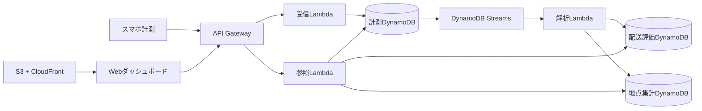

# システム構成

## 境界と責務

`apps/` は端末・ブラウザで動く画面、`services/` はクラウド側処理、`infra/` はリソース構成、`contracts/` は担当間の接続契約を管理します。受信・解析・参照は個別に実装・検証できる単位とします。

計測データと解析結果の保存先を分け、計測テーブルのStreamsのみで解析を起動します。再送・Streamsの再実行・順不同の受信を前提に、保存と集計の冪等性を設計します。

配送評価と地点集計のキー・インデックスは、配送一覧・時系列・地図範囲などの参照要件から決めます。約50mの集計区画、配送終了の判定、GPS品質、計測条件、アルゴリズムのバージョン管理は設計確定前の課題です。

位置情報の閲覧はチーム内に限定します。予算・期間・評価条件は元の実験概要資料を確認して確定します。
